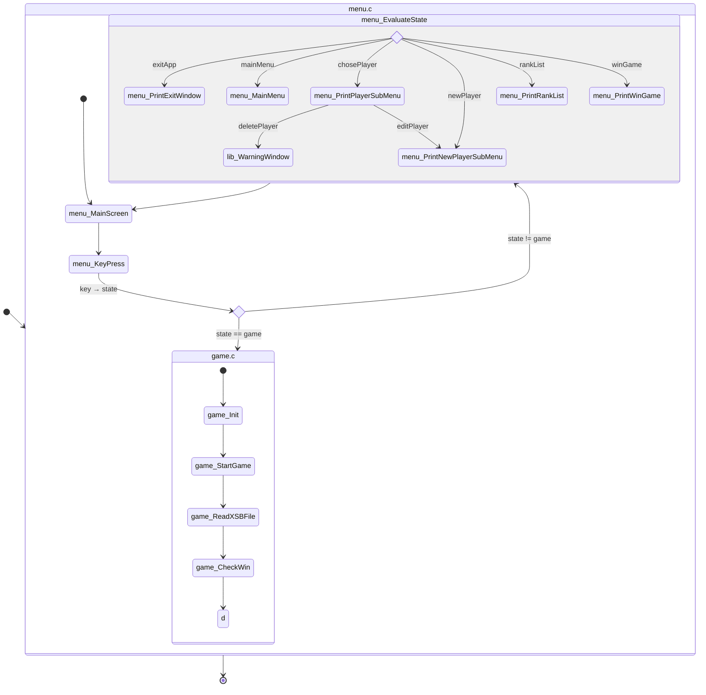

# Szokoban - Programozói dokumentáció

> Készítette: Szenes Mártons

---

## Tartalom

- [Program felépítése](#program-felépítése)
  - [A menü](#a-menü)
    - [Menü állapotai](#menü-állapotai-state)
    - [Menü működése](#menü-működése-mainscreen)
    - [Játékos struktúra](#játékos-player-struktúra)
    - [Szint statisztika](#szint-statisztika-statistics-struktúra)
  - [A játék](#a-játék)
    - [Játékmenet működése](#játékmenet-működése)

## Program felépítése

A program két fő részből áll, a [menürendszerbő](#a-menü) (menu.c) és a [játékból](#a-játék) (game.c). Az indításkor először a menürendszer nyílik meg, és onnan tud a felhasználó elnavigálni az _Új játék_ almenübe, majd a játékos kiválasztása után elindul a játék. A játék befejeztével visszalép a program a menübe, és innen tud a felhasználó más almenükbe átlépni vagy kilépni a programból.

### A menü

A program indítása után a `main` beállítja a karaterkódolást, és meghívja a [`void menu_MainScreen() {...}`](#menü-működése-mainscreen)-t. Ez az eljárás futtatja ciklikusan a menüt, amíg ki nem lép a felhasználó a programból.
A menü állapotait egy [`enum State {...}`](#menü-állapotai-state)-ben tárolja a program, mivel véges számú állapota lehet a menünek, és ezáltal könnyű azonosítani az egyes menüpontokat.

#### Menü állapotai (State)

A menüben való navigálás során a következő állapotok léphetnek fel:

- `mainMenu`: A program indításákor ez az alapállot, a főmenüt jelenti.
- `newPlayer`: A főmenü első menüpontja, ez az állapot az új játékos hozzáadását jelenti.
- `chosePlayer`: A főmenü második menüpontja, ez az állapot a játékosválasztást jelenti.
- `rankList`: A főmenü harmadik menüpontja, a dicsőséglistát jelenti.
- `exitApp`: A főmenü negyedik menüpontja, kilépés a programból.
- `deletePlayer`: A `chosePlayer` állapotból léphet ebbe a program. A játékos törlését jelenti.
- `editPlayer`: A `chosePlayer` állapotból léphet ebbe a program. A játékosnév szerkesztését jelenti.
- `game`: A `chosePlayer` állapotból léphet ebbe a program. A játék futtatását jelenti.
- `exitGame`: A `game` állapotból léphet ebbe a program. A játékból való kilépést jelenti.
- `winGame`: A `game` állapotból léphet ebbe a program. Az összes szint teljesítését jelenti.

```c
typedef enum State {
    mainMenu,
    newPlayer,
    chosePlayer,
    rankList,
    exitApp,
    deletePlayer,
    editPlayer,
    game,
    exitGame,
    winGame
} State;
```

#### Menü működése (MainScreen)

A [`void menu_MainScreen()`](#void-menumainscreen) eljárás pszedudókóddal leírva:

```
Eljárás Menü():
    Változók inicializálása
    Főcím kiiratása
    Szintek mappájának beolvasás

    Ciklus amíg menü fut
        Lenyomott billentyű kiértékelése
        Ha játékos kiválasztva, akkor
            Játék indítás
        Képernyőre írás menüpont
        Ha fut a menü, akkor
            Billentyűnyomásra vár
    Ciklus vége

    Játékosok adatainak mentése
    Lefoglalt memóriaterületek felszabadítása
Eljárás vége
```

##### Játékos (Player) struktúra

A fő adatstruktúra a menüben a `Player` struktúra. Ebben tárolja a program az egyes játékosok adatait: név, szint, statisztika, következő játékosra mutató pointer.  
A `name` mező a játékos nevét tárolja. Hossza a `datatypes.h` fájlban található makró szerint határozott meg (`#define nameLenght 20`). Ez azt jelenti, hogy a képernyőn 20 db karakter fog maximum megjelenni. Mivel ékezetes karaktereket is tartalmazhat a név (á, é, í, ó, ö, ő, ú, ü, ű), amik 2 byte-on tárolódnak, ezért a 2-szeresét vesszük és +1 byte-ot a lezáró nullának, így jön ki a hossza.  
A `numOfCompletedLevels` mező a játékos szintjét tárolja, hogy hágy szintet teljesített már.  
A `*levelStats` egy [`Statistics`](#szint-statisztika-statistics-struktúra) típusú láncolt lista első elemére mutató pointer. Ebben tárolja el a program a játékos által megtett lépések számát az egyes szinteken.  
A `*next` a következő `Player` struktúrára mutató pointer a láncolt listában.

```c
typedef struct player {
    char name[nameLenght*2+1];
    int numOfCompletedLevels;
    struct Statistics *levelStats;
    struct Player *next;
} Player;
```

##### Szint statisztika (Statistics) struktúra

A játékosok dicsőséglistájához elengedhetetlen számon tartani, hogy mely játékos, hány lépéssel tudta teljesíteni az egyes szeinteket. Ezt a tulajdonságot egy `Statistics` struktúrában tárolja a program.  
A megtett lépések számát egy egész számként tárolja a `stepCount` mezőben.  
A `*next` a következő `Statistics` struktúrára mutató pointer a láncolt listában.

```c
typedef struct statistic{
    int stepCount;
    struct Statistics *next;
} Statistics;
```

### A játék

A játékot a [`bool game_Init()`]() fügvénnyel lehet meghívni a `game.c` fájlon kívülről. Ez hívja meg benne a `bool game_StartGame()` függvényt, ami a játékot elindítja és futtatja ciklikusan. Erre a két függvényre azért van szükség, hogy a program moduláris lehessen. Tehát ha például más játékot szeretnénk leprogramozni, amiben hasonlóan több játékos lehet és a szintek egymás után következnek, akkor ugyanazokkal a paraméterekkel meg lehet hívni a `game_Init()` függvényt, ami majd a másik játék függvényeit hívja meg.

#### Játékmenet működése

A `bool game_StartGame()` függvény pszeudókóddal leírva:

```
Függvény Játék(játékos, szint): visza logikai
    Változók inicializálása
    Szint beolvasása fájlból
    Szint kiírása a képernyőre

    Ciklus amíg nincs a szint teljesítve
        Billentyűnyomásra vár
        Lenyomott billentyű kiértékelése:
            Ha Esc, akkor
                Kilépés
            Különben ha kurzor billentyű, akkor
                Ha lehetséges a lépés, akkor
                    Lépés lebonyolítása
            Különben ha V, akkor
                Előző lépés visszavonása
            Különben ha R, akkor
                Szint újrakezdése
        Elágazás vége
    Ciklus vége
    Lefoglalt memóriaterületek felszabadítása

    Ha szint teljesítve, akkor
        Játékos szintje növelése 1-el
        Lépések száma hozzáadása a játékos statisztikájához
        vissza igaz
    Különben
        vissza hamis
    Elágazás vége
Függvény vége
```

#### A pálya

A játékban a pályát, vagyis az adott szint mezőinek elrendezését a program a `levels` mappából olvassa be. Minden pálya külön [`.xsb` fájlban]() van eltárolva. Így a `levels` mappához tetszés szerint lehet pályákat hozzáadni és elvenni. Fontos megjegyezni, hogy a program a pályákat fájlnevek szerint 'abc' rendben fogja beolvasni és eltárolni. Tehát fájlnév szerint növekvő sorrendbe rendezve fognak következni egymás után a szintek. Így könnyő besorolni az egyes szinteket nehézségük szerint.  
A pályákat két fő változó írja le:

```c
CellType **map = NULL;
Size mapSize;
```

A `**map` egy kétdimenziós dinamikus tömb (mátrix), aminek minden eleme a pályán egy-egy mező, amiben [`CellType`](#cellatípusok-celltype) típussal kódolja a program a mező értékeit.
A `mapSize` egy [`Size`](#méret-size) struktúrában tárolja el a pálya méreteit. 
#### Cellatípusok (CellType)

Egy pálya beolvasásakor az `.xsb` fájlt dekódolja a program, és a dekódolt értékeket a `**map`-ben tárolja el. Az egyes cellák a következő értékeket vehetik fel:  
- `null`: Érvénytelen cellatípus, a fájl beolvasáskor rossz bemeneti karakter esetén.
- `EMPTY`: Üres mező, ami vagy a játéktéren kívül van, vagy a falakon belül, amin tud mozogni a játékos bábuja.
- `WALL`: A fal a játéktér határoló karatere. Erre nem léphet a játékos, nem tudja elmozdítani
- `TARGET`: A dobozok célmezője. Ezekkel jelölt cellákra kell a játékosnak tolnia a dobozokat. Erre léphet a játékos, de nem tudja elmozdítani. 
- `PLAYER`: A játékbábu, ha üres mezőn áll.
- `PLAYERONTARGET`: A játékosbábú, ha célmezőn áll.
- `BOX`: A doboz, elmozdíthatja a játékos, de nem léphet rá erre a cellára.
- `BOXONTARGET`: A doboz, ha célmezőn van. A játékos el tudja mozdítni, de nem léphet rá. 

```c
typedef enum celltype {
    null,
    EMPTY,
    WALL,
    TARGET,
    PLAYER,
    PLAYERONTARGET,
    BOX,
    BOXONTARGET
} CellType;
```
#### Méret (Size)

A pálya beolvasásnál először meghatározza a program, hogy mekkora pályára lesz szüksége a cellák eltárolásához. Így a pályának a szélessége az egyes sorokból a leghosszabb karakterszámú lesz, a magassága pedig a beolvasott nem üres sorok száma.  
Ezt a `mapSzize` változóban tárolja a program
```c
typedef struct size{
    int width;
    int height;
} Size;
```

### Struktúrák

#### Pozíció (Point)

```c
/** Egy koordinátát eltároló struktúra, mely láncolt listába fűzhető */
typedef struct point{
    int x, y;   // Koordináták
} Point;
```


#### Lépés (Move)

```c
/* A játékos egy lépését tároló struktúra, mely láncolt listába fűzhető */
typedef struct move{
    Point from;         // A játékos által elhagyott mező koordinátája
    Point to;           // A játékos által meglépett mező koordinátája
    bool boxPushed;     // Logikai, eltolt-e a játékos a lépés során dobozt
    struct Move *next;  // a lépéseket tároló láncolt listában a következő elemre mutató pointer
} Move;
```

## Kód szerekzete

### Függvények rendszere



## Kód részeltes dokumentációja

## Algoritmusok - Függvénydokumentáció

---

### Menu.h

<!-- BEGIN DOC-COMMENT H4 headers/menu.h -->

#### `void menu_MainScreen()`

A főmenüt futtató függvény. Egyszer hivandó meg a mainben

<!-- END DOC-COMMENT -->

---

### Game.h

<!-- BEGIN DOC-COMMENT H4 headers/game.h -->

#### `bool game_Init(Player *player, char **levelList)`

Ezzel kell meghívni a játékot. Inicializálja a játékhoz szükséges elemeket  
**Paraméterek:**

- `Player*` — `player` — Az aktuális játékos adatait tartalmazza (Cím szerint)
- `char[][]` — `levelList` — A pályák fájlneveit tartalmazó string tömb

**Visszatér:** `bool` — Igaz, ha a játékos teljesítette a szintet; Hamis, ha a játékos kilépett a játékból

<!-- END DOC-COMMENT -->

---

### Level.h

<!-- BEGIN DOC-COMMENT H4 headers/level.h -->

#### `void level_ReadDirectory(char directory[], char **levelList[], int *numOfFiles)`

Beolvassa a megadott mappából a fájlneveket, és eltárolja egy dinamikusan foglalt tömbben
**Paraméterek:**

- `char[]` — `directory` — A mappa elérési útvonala
- `*char[][]` — `levelList` — A dinamikusan foglalt string tömb (Cím szerint)
- `int*` — `numOfFiles` — A Beolvasott fájlnevek száma (Cím szerint)

#### `void level_FreeLevelList(char **levelList[], int *numOfLevels)`

Felszabadítja a dinamikusan foglalt fájlnevek string tömbjét
**Paraméterek:**

- `*char[][]` — `levelList` — A dinamikusan foglalt string tömb (Cím szerint)
- `int*` — `numOfLevels` — A Beolvasott fájlnevek száma (Cím szerint)

<!-- END DOC-COMMENT -->

---

### Lib.h

<!-- BEGIN DOC-COMMENT H4 headers/lib.h -->

#### `void lib_WarningWindow(const char Message[], Point p, bool *displayFirst, int option, EconioColor baseColor, EconioColor accentForeColor, EconioColor accentBgColor)`

Kiír a képernyőre egy figyelmeztető ablakot a megadott Message üzenettel, Igen/Nem válaszlehetőségekkel
**Paraméterek:**

- `char[]` — `Message` — Az üzenet
- `Point` — `p` — képernyő közepének koordinátája
- `bool*` — `displayFirst` — Először megy-e be a ciklus a menüpontba tulajdonság (Cím szerint)
- `int` — `option` — A kiválasztott opció
- `EconioColor` — `baseColor` — Alap betűszíne az ablaknak
- `EconioColor` — `accentForeColor` — Kijelölt opció betűszíne
- `EconioColor` — `accentBgColor` — Kijelölt opció háttérszíne

#### `void lib_ClearScrBellow()`

Letörli a cím alatt lévő területet a képernyőről

#### `void lib_ClearScreenSection(int x1, int y1, int x2, int y2, EconioColor bgColor)`

Letörli a képernyőt megadott koordinátákon belül a kapott bgColor színnel.
**Paraméterek:**

- `int` — `x1` — Bal felső sarok x koordinátája
- `int` — `y1` — Bal felső sarok y koordinátája
- `int` — `x2` — Jobb alsó sarok x koordinátája
- `int` — `y2` — Jobb alsó sarok y koordinátája
- `EconioColor` — `bgColor` — Törlendő terület háttérszíne

#### `void lib_printError(const char errormessage[])`

Kiírja képernyőre a hibaüzenetet
**Paraméterek:**

- `char[]` — `errormessage` — Hibaüzenet

#### `void print(char const str[], int x, int y)`

Kiírja a képernyőre a kapott szöveget a megadott kezdő koordinátákra
**Paraméterek:**

- `char[]` — `str` — Kiírandó szöveg
- `int` — `x` — x koordináta a képernyőn
- `int` — `y` — y koordniáta a képernyőn

#### `void printfc(char const str[], int x, int y, EconioColor foreColor)`

Kiírja a képernyőre a kapott szöveget a megadott kezdő koordinátákra a megadott betűszínnel
**Paraméterek:**

- `char[]` — `str` — Kiírandó szöveg
- `int` — `x` — x koordináta a képernyőn
- `int` — `y` — y koordniáta a képernyőn
- `EconioColor` — `foreColor` — A szöveg színe

#### `void printfbc(char const str[], int x, int y, EconioColor foreColor, EconioColor bgColor)`

Kiírja a képernyőre a kapott szöveget a megadott kezdő koordinátákra a megadott betűszínnel és háttérszínnel
**Paraméterek:**

- `char[]` — `str` — Kiírandó szöveg
- `int` — `x` — x koordináta a képernyőn
- `int` — `y` — y koordniáta a képernyőn
- `EconioColor` — `foreColor` — A szöveg színe
- `EconioColor` — `bgColor` — A szöveg háttérszíne

#### `Point addPoints(Point a, Point b)`

Két pont koordinátáit összeadó függvény
**Paraméterek:**

- `Point` — `a` — Egyik koordináta
- `Point` — `b` — Másik koordináta

**Visszatér:** `Point` — Koordináták összege

#### `Point subPoints(Point a, Point b)`

Két pont koordinátáinak különbségét kiszámoló függvény
**Paraméterek:**

- `Point` — `a` — Egyik koordináta
- `Point` — `b` — Másik koordniáta

**Visszatér:** `Point` — Koordináták különbsége

#### `bool comparePoints(Point a, Point b)`

Két pontot hasonlít össze, hogy egyenlőek-e
**Paraméterek:**

- `Point` — `a` — Egyik koordináta
- `Point` — `b` — Másik koordináta

**Visszatér:** `bool` — Egyenlőek e a paraméterként kapott koordináták

#### `int stringlenght(const char str[])`

Megszámolja, hogy a kapott string hány valós karakterből áll, hány krakter íródik ki a képernyőre
**Paraméterek:**

- `char[]` — `str` — Karaktertömb, string (Bemenet)

**Visszatér:** `int` — A string hossza megjelenített karakterszámban

#### `int stringlenghtMax(const char str[], int max)`

Megszámolja, hogy hány byte-on tárolódik a max karakterszámú string
**Paraméterek:**

- `char[]` — `str` — Karaktertömb, string (Bemenet)
- `int` — `max` — Megjelenítendő karakterek száma

**Visszatér:** `int` — Megjelenítendő string max karakterű byte hossza

#### `bool isBlankString(const char* str)`

Megnézi a függvény, hogy a string csak üres karaktereket tartalmaz-e (szóköz, \\n, \t)
**Paraméterek:**

- `char[]` — `str` — Karaktertömb, string (Bemenet)

**Visszatér:** `bool` — Csak üres karaktereket tartalmaz-e a string

<!-- END DOC-COMMENT -->

---

<!--### Datatypes.h-->

<!-- BEGIN DOC-COMMENT H4 headers/datatypes.h -->
<!--
#### `typedef enum celltype`

A pálya egyes mezőinek lehetséges értékei

#### `typedef enum State`

A menü lehetséges állapotértékei

#### `typedef struct point`

Egy koordinátát eltároló struktúra, mely láncolt listába fűzhető

#### `int x, y`

Koordinátái

#### `struct Point *next`

< A következő pontra mutató pointer a láncolt listában
-->

<!-- END DOC-COMMENT -->

---

### Player.h

<!-- BEGIN DOC-COMMENT H4 headers/player.h -->

#### `void player_ReadTxtFile(Player **playerListHead, int *numOfPlayers)`

Beolvassa a playerDataPath-ban megadott fájlt, és elátrolja a playerListHead láncolt listában
**Paraméterek:**

- `Player**` — `playerListHead` — A játékosok adatait tartalmazó láncolt lista (Cím szerint)
- `int*` — `numOfPlayers` — A játékosok darabszáma (Cím szerint)

#### `void player_WriteTxtFile(Player *playerListHead, int numOfPlayers)`

Kiírja fájlba a playeListHead-ben tárolt játékosok adatait: név;szintek;lépészámok..
**Paraméterek:**

- `Player*` — `playerListHead` — sA játékosok adatait tartalmazó láncolt lista (Cím szerint)
- `int` — `numOfPlayers` — A játékosok darabszáma (Cím szerint)

#### `Player *player_MakePlayer(char name[], int numOfLevels, Statistics *statsListHead)`

Létrehoz egy Player struktúrára mutató pointert a paraméterként kapott értékekből, hogy aztán Lístába lehessen fűzni.
**Paraméterek:**

- `char[]` — `name` — A játékos neve (max 20 karakter)
- `int` — `numOfLevels` — A játékos által teljesített szintek száma
- `Statistics` — `statsListHead` — A játékos lépésstatisztikájának láncolt listája

**Visszatér:** `Player*` — Player struktúrára mutató pointer a kapott adatokkal

#### `void player_FreePlayerList(Player **playerListHead)`

Felszabadítja a az egész láncolt listának foglalt memóriát
**Paraméterek:**

- `Player**` — `playerListHead` — A játékosok adatait tartalmazó láncolt lista (Cím szerint)

#### `static void player_FreePlayerNode(Player **playerNode)`

Felszabadítja egy elem lefoglalt memóriáját a listából
**Paraméterek:**

- `Player**` — `playerNode` — Egy Player struktúrára mutató pointer a láncolt listából (Cím szerint)

#### `void player_AddPlayerToEnd(Player *newPlayer, Player **playerListHead, int *numOfPlayers)`

Beszúrja a játékoslistának a végére az új játékos elemet
**Paraméterek:**

- `Player*` — `newPlayer` — Új játékos struktúrájára mutató pointer
- `Player**` — `playerListHead` — A játékosok adatait tartalmazó láncolt lista (Cím szerint)
- `int*` — `numOfPlayers` — A játékosok darabszáma (Cím szerint)

#### `void player_AddPlayerInOrder(Player *newPlayer, Player **playerListHead, int *numOfPlayers)`

Beszúrja a játékoslistába au új játékost a nevének a hossza szerint növekvő sorrendben
**Paraméterek:**

- `Player*` — `newPlayer` — Új játékos struktúrájára mutató pointer
- `Player**` — `playerListHead` — A játékosok adatait tartalmazó láncolt lista (Cím szerint)
- `int*` — `numOfPlayers` — A játékosok darabszáma (Cím szerint)

#### `bool player_RemovePlayer(Player *removablePlayer, Player **playerListHead, int *numOfPlayers)`

Törli a paramterként kapott játékost a listából
**Paraméterek:**

- `Player*` — `removablePlayer` — A törlendő játékos struktúrájára mutató pointer
- `Player**` — `playerListHead` — A játékosok adatait tartalmazó láncolt lista (Cím szerint)
- `int*` — `numOfPlayers` — A játékosok darabszáma (Cím szerint)

**Visszatér:** `bool` — Igaz, ha sikeres a törlés a listából; Hamis, ha nem sikerült törölni a játékost

#### `Player* player_GetSelectedPlayer(Player *playerListHead, int selectedPlayer)`

Megkeresi a listában a selectedPlayer-edik elemet
**Paraméterek:**

- `Player*` — `playerListHead` — A játékosok adatait tartalmazó láncolt lista
- `int` — `selectedPlayer` — A játékos sorszáma / indexe a listában

**Visszatér:** `Player*` — A keresett játékos struktúrájára mutató pointer, ha megtalálta, különben NULL pointer

#### `int player_GetIndexOfPlayer(Player *playerListHead, char name[])`

Megkeresi a listában a játékos nevét, és visszaadja a sorszámát / indexét a listában
**Paraméterek:**

- `Player*` — `playerListHead` — A játékosok adatait tartalmazó láncolt lista
- `char[]` — `name` — A keresett játékos neve

**Visszatér:** `int` — A keresett játékos indexe, ha megtalálta, különben -1

#### `void player_PrintPlayerList(Player *playerList, int selectedPlayerIndex, Point p)`

Kiírja a képernyőre a játékoslistát (nevüket és szintjüket) egymás alá, és kiemeli az aktuálisan kiválasztott játékost
**Paraméterek:**

- `Player*` — `playerList` — A játékosok adatait tartalmazó láncolt lista
- `int` — `selectedPlayerIndex` — Az aktuálisan kiválasztott játékos sorszáma / indexe
- `Point` — `p` — A kiíráshoz legfelső középső pont a képernyőn

<!-- END DOC-COMMENT -->

### Statistics.h

---

<!-- BEGIN DOC-COMMENT H4 headers/statistics.h -->

#### `void stats_AddLevelStatistics(int stepCount, Statistics **statsListHead)`

Beszúrja a paraméterként kapott stepCount értéket a statsListHead láncolt lista végére
**Paraméterek:**

- `int` — `stepCount` — A szinten megtett lépések száma
- `Statistics**` — `statsListHead` — A lépések számát tároló láncolt lista (Cím szerint)

#### `void stats_FreeStatisticsList(Statistics **statsListHead)`

Felszabadítja a az egész láncolt listának foglalt memóriát
**Paraméterek:**

- `Statistics**` — `statsListHead` — A lépések számát tároló láncolt lista (Cím szerint)

<!-- END DOC-COMMENT -->

---

### Move.h

<!-- BEGIN DOC-COMMENT H4 headers/move.h -->

#### `Move* move_CreateMove(Point stepfrom, Point stepTo, bool boxPushed)`

Létrehoz egy Move struktúrára mutató pointert a paraméterként kapott értékekből, hogy aztán Lístába lehessen fűzni.
**Paraméterek:**

- `Point` — `stepfrom` — A legutolsó pozíció koordinátája
- `Point` — `stepTo` — A következő pozíció koordinátája
- `bool` — `boxPushed` — Igaz, ha eltolt doboz; Hamis, ha csak a játékos mozdult el

**Visszatér:** `Move*` — Move strúktúrára mutató pointer a kapott paraméterekkel

#### `void move_AddMoveToList(Move *newMove, Move **moveListHead)`

Beszúrja a paraméterként kapott newMove elemet a láncolt lista (moveListHead) elejére
**Paraméterek:**

- `Move*` — `newMove` — Új elmozdulást tároló struktúrára mutató pointer
- `Move**` — `moveListHead` — Az elmozdulásokat tároló láncolt lista (Verem/Stack)

#### `Move move_RemoveMoveFromList(Move **moveListHead)`

Eltávolítja az első elemet a láncolt listából (Veremből/Stack)
**Paraméterek:**

- `Move**` — `moveListHead` — Az elmozdulásokat tároló láncolt lista (Verem/Stack) (Cím szerint)

**Visszatér:** `Move` — Visszaadja az eltávolított listaelem struktúráját

#### `void move_FreeMoveList(Move **moveListHead)`

Felszabadítja a az egész láncolt listának foglalt memóriát
**Paraméterek:**

- `Move**` — `moveListHead` — Az elmozdulásokat tároló láncolt lista (Verem/Stack) (Cím szerint)

<!-- END DOC-COMMENT -->

> powershell:
> D:\Programozas\soko>
> & "C:\Users\Szenes Márton\node_modules\.bin\docblox2md" .\SsokobanDevDoc.md
