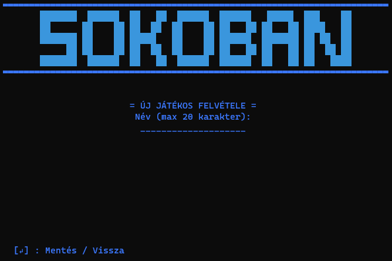
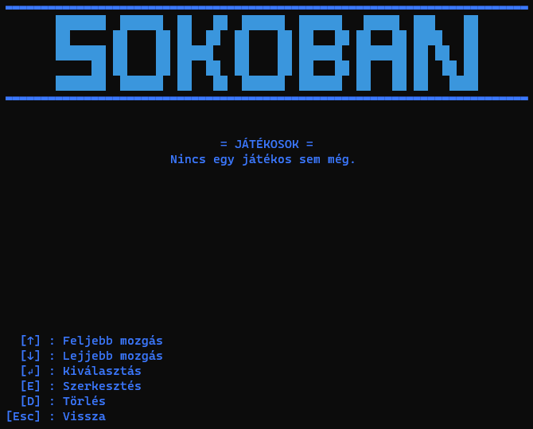
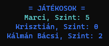
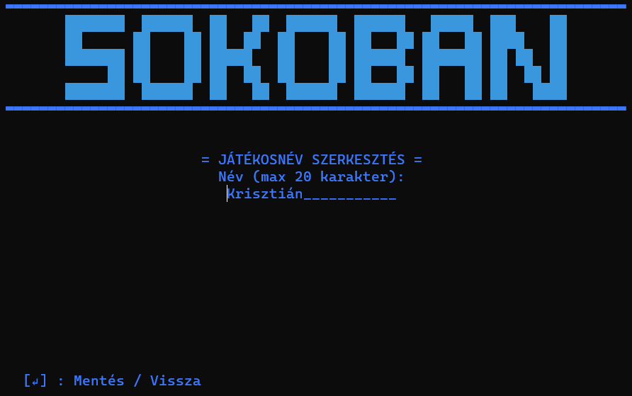
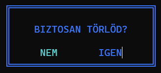
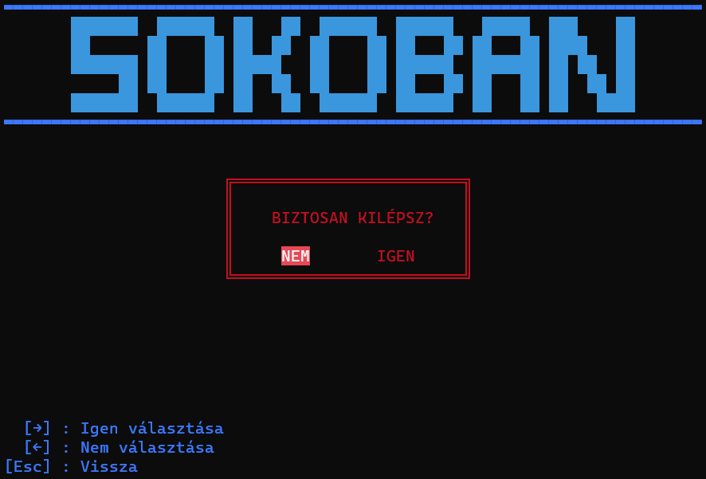
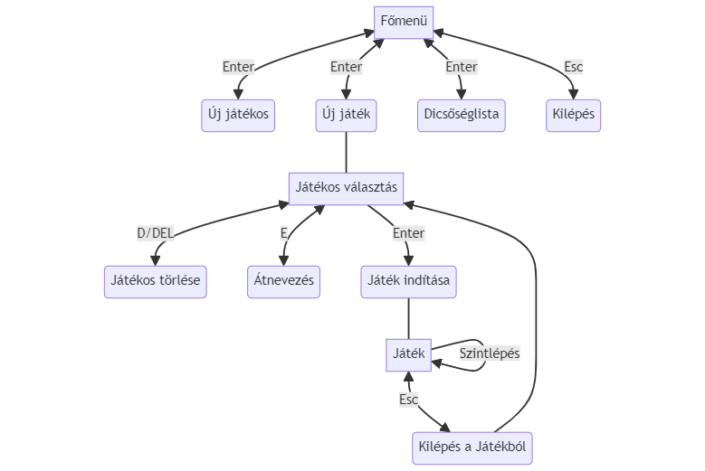

# Szokoban - Felhasználói dokumentáció

> Készítette: Szenes Márton

## Játékról

A Szokoban egy olyan játék, ahol a játékosnak ládákat kell tologatni a játékterületen úgy, hogy azok a megfelelő helyre
kerüljenek. A pálya viszont olyan, hogy könnyű betolni olyan helyre a ládákat, ahonnan már nem lehet elmozdítani azokat. A
pálya egy 2 dimenziós felülnézetű térben helyezkedik el. A játékterület (amin belül a játékos és a ládák el vannak helyezve) mindig fallal van körbe véve, hogy ne tudjon azon kívül mozdulni egyik objektum se. Egy adott pálya akkor van
teljesítve, ha az összes célmezőre egy-egy láda lett tolva. Az egyes pályák nehézség szerint, sorrendben következnek egymás után.

## Program használata

### Főmenü

A program elindításakor a _Főmenü_ jelenik meg a terminálon. A programban mindig a bal alsó sarokban
találhatóak meg a navigációs billentyűk, amikkel lehet mozgatni a kijelölést, belemenni egy menüpontba, a játékost mozgatni vagy kilépni abból.  
A főmenüben a következő menüpontokat lehet megtalálni:

- [Új játékos](#új-játékos)
- [Játék indítása](#játék-indítása)
- [Dicsőséglista](#dicsőséglista)
- [Kilépés](#kilépés)

A menüben a `↑`(fel), `↓` (le), `→` (jobbra), `←` (balra) kurzor billentyűkkel lehet navigálni. Egy menüpont
kiválasztása az `Enter` billentyű lenyomásával véglegesíthető. Visszalépni egy menüpontból az `Esc` vagy a `Backspace`
billentyűkkel lehetséges. Ha a főképernyőn nyomjuk meg utóbbi billentyűk valamelyikét, akkor a [Kilépés](#kilépés) menü
ugrik fel.

### Új játékos

Az _Új játékos_ menüt kiválasztva megjelenik egy 20 karakter széles beviteli mező. Ide lehet bevinni a billentyűzetről
az új játékos nevét, ami tartalmazhat ékezetes- és nem ékezetes karaktereket is. A kívánt név beírása után az `Enter`-t
lenyomva elmenti a program a játékosnevet, és visszalép a [Főmenü](#főmenü)-be. Ha mégsem szeretne a felhasználó új
nevet bevinni, akkor nyojon `Enter`-t bevitel nélkül.  

### Játék indítása

A _Játék indítása_ menüt kiválasztva megjelennek az adatbázisban szereplő játékosok és az általuk teljesített szint száma.
Amennyiben még egy játékos sem lett felvéve az adatbázisba, akkor a _"Nincs egy játékos sem még."_ felirat jelenik meg.
A Játékos felvételéhez navigáljon az [Új játékos](#új-játékos) menübe. A játékosok között a kurzor billentyűkkel ( `↑`(
fel), `↓` (le) ) lehet navigálni, és az `Enter` billentyűt lenyomva lehet kiválasztani egy játékost és elindítani
a [Játékot](#játékmenet).

| Üres játékoslista                                           | Nem üres játékoslista                                 |
|-------------------------------------------------------------|-------------------------------------------------------|
|  |  |

#### Játékosnév szerkesztése

A felvett játékosok nevét lehet szerkeszteni. Ehhez navigálja a kijelölést a kívánt játékosra a listában, és az `E`
billentyű lenyomásával megnyílik a játékosnév szerkesztése almenü, amiben átírhatja a nevet. A mentéshez nyomja meg
az `Enter`-t. Ha mégsem szeretné szerkeszteni, nyomjon `Enter`-t bevitel nélkül.  

#### Játékos törlése

A felvett játékosokat lehet törölni. Ehhez navigálja a kijelölést az eltávolítani kívánt játékosra a listában, és
a `D` / `DELETE` billentyű lenyomásával megjelenik egy ablak, amiben rákérdez a program, hogy _"Biztos törlöd?"_-e.
_Igen_/_Nem_ opciók közül az _Igen_-t választva törlődik a játékos az adatbázisból, a _Nem_-et választva pedig visszatér
a program a [Játékoslistához](#játék-indítása).  

### Dicsőséglista

A _Dicsőséglista_ menüt kiválasztva megjelenik egy táblázat, amiben a játékosok által az egyes szinteken megtett lépések száma jelenik meg. A fejlécben a játékosok neve található, a bal szélső oszlopban pedig a szint sorszáma.

### Kilépés

A _Kilépés_ menüt kiválasztva megjelenik egy ablak, amiben rákérdez a program, hogy _"Biztos kilépsz?"_-e. _Igen_/_Nem_
opciók közül az _Igen_-t választva a program leáll, a _Nem_-et választva pedig visszatér a program a [Főmenü](#főmenü)
-be.

## Játékmenet

### Tutorial pálya

A játék elindításakor megjelenik a pálya, a szint sorszáma és a megtett lépések száma. Ha új játékos
indítja el első alkalommal a játékot, akkor a tutorial (bemutató) szint indul el. Itt röviden elmagyarázza a program a játékot. Ez
a szint nem számít bele a statisztikába. Célja, hogy megismerje a felhasználó a játékosbábu- és a dobozok mozgatási lehetőségét.  
A pályákon megjelenő mezők és jelentésük:
- Fal: █
- Játékos: ☻
- Játékos a célmezőn: ☻
- Doboz: ◼
- Doboz a célmezőn: ◼
- Célmező: ◻  

### A játék

A további szinteken már csak a szint sorszáma és a lépésszám lesz megjelenítve a pálya mellett. A navigációs billentyűk,
ahogy a menüben is a képernyő bal alsó sarkában találhatók.

- **Mozgás:** A játékosbábu mozgatását a kurzor billentyűkkel lehetséges (`↑`(fel), `↓` (le), `→` (jobbra), `←` (balra))
- **Visszalépés:** Egy lépés visszavonását a `V` billentyű lenyomásával lehet elérni, azonban minden egyes visszalépés
  ugyanúgy lépésnek számít, így egyel növeli a lépések számát, hogy _fair play_ (sportszerű) legyen ennek a funkciónak a
  használata.
- **Újrakezdés:** Az `R` billentyű lenyomásával újraindul az adott szint, visszaáll minden mező az eredeti állapotára és
  a lépésszámláló is nullázódik. Ezáltal újból megpróbálhatja a játékos a pályát elölről teljesíteni.

## Játék menürendszere

> Jó játékot kíván a készítő, Szenes Márton!
