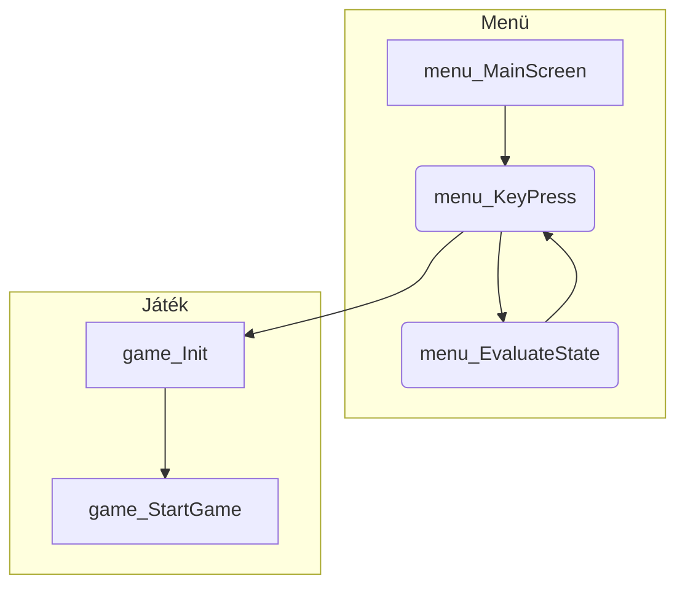

# Szokoban - Programozói dokumentáció

> Készítette: Szenes Mártons

## Program felépítése

A program két fő részből áll, a [menürendszerbő](#a-menü) (menu.c) és a [játékból](#a-játék) (game.c). Az indításkor először a menürendszer nyílik meg, és onnan tud a felhasználó elnavigálni az _Új játék_ almenübe, majd a játékos kiválasztása után elindul a játék. A játék befejeztével visszalép a program a menübe, és innen tud a felhasználó más almenükbe átlépni vagy kilépni a programból.
### A menü
A program indítása után a `main` beállítja a karaterkódolást, és meghívja a [`void menu_MainScreen() {...}`]()-t. Ez az eljárás futtatja ciklikusan a menüt, amíg ki nem lép a felhasználó a programból.
A menü állapotait egy [`enum State {...}`](#menü-állapotai-state)-ben tárolja a program, mivel véges számú állapota lehet a menünek, és ezáltal könnyű azonosítani az egyes menüpontokat. 
#### Menü állapotai (State)
```c
/** A menü lehetséges állapotértékei */
typedef enum State {
    mainMenu,
    newPlayer,
    chosePlayer,
    rankList,
    exitApp,
    deletePlayer,
    editPlayer,
    game,
    exitGame,
    winGame
} State;
```
#### Menü eljárás pszeudókóddal
```
Eljárás menu_MainScreen():
    Változók inicializálása
    Főcím kiiratása
    Szintek mappájának beolvasás

    Ciklus amíg menü fut
        Lenyomott billentyű kiértékelése
        Képernyőre írás menüpont alapján
        Ha fut a menü, billentyűlenyomásra vár
    Ciklus vége

    Játékosok adatainak mentése
    Lefoglalt memóriaterületek felszabadítása
Eljárás vége
```
A fő adatstruktúra a menüben a `Player` struktúra:
```c
/* A játékos adatait eltároló struktúra, mely láncolt listába fűzhető */
typedef struct player {
    char name[nameLenght*2+1];      
    int numOfCompletedLevels;       
    struct Statistics *levelStats;  
    struct Player *next;            
} Player;
```

### A játék

A játékot a [`bool game_Init()`]() eljárással lehet meghívni...

### Függvények rendszere



## Adatstruktúrák

### Enumerátorok

#### Mezőtípusok (CellType)

```c
/* A pálya egyes mezőinek lehetséges értékei.*/
typedef enum celltype { null, EMPTY, WALL, TARGET, PLAYER, PLAYERONTARGET, BOX, BOXONTARGET } CellType;
```
### Struktúrák

#### Pozíció (Point)

```c
/** Egy koordinátát eltároló struktúra, mely láncolt listába fűzhető */
typedef struct point{
int x, y;           // Koordináták
struct Point *next; // A következő pontra mutató pointer a láncolt listában
} Point;
```

#### Méret (Size)

```c
/** A pálya méretét eltároló struktúra */
typedef struct size{
int width;  // A pálya szélessége
int height; // A pálya magassága
} Size;
```

#### Lépés (Move)

```c
/* A játékos egy lépését tároló struktúra, mely láncolt listába fűzhető */
typedef struct move{
    Point from;         // A játékos által elhagyott mező koordinátája
    Point to;           // A játékos által meglépett mező koordinátája
    bool boxPushed;     // Logikai, eltolt-e a játékos a lépés során dobozt
    struct Move *next;  // a lépéseket tároló láncolt listában a következő elemre mutató pointer
} Move;
```

#### Szint statisztika (Statistics)

```c
/* A játékos egy szinten megtett lépéseinek számát tároló struktúra, mely láncolt listába fűzhető */
typedef struct statistic{
    int stepCount;           // Egy szinten a játékos által megtett lépések száma
    struct Statistics *next; // A statisztika láncolt listában a következő elemre mutató pointer
} Statistics;
```

## Kód szerekzete

## Kód részeltes dokumentációja

## Algoritmusok - Függvénydokumentáció

---

### Menu.h

<!-- BEGIN DOC-COMMENT H4 headers/menu.h -->

#### `void menu_MainScreen()`

A főmenüt futtató függvény. Egyszer hivandó meg a mainben

<!-- END DOC-COMMENT -->

---

### Game.h

<!-- BEGIN DOC-COMMENT H4 headers/game.h -->

#### `bool game_Init(Player *player, char **levelList)`

Ezzel kell meghívni a játékot. Inicializálja a játékhoz szükséges elemeket  
**Paraméterek:**

- `Player*` — `player` — Az aktuális játékos adatait tartalmazza (Cím szerint)
- `char[][]` — `levelList` — A pályák fájlneveit tartalmazó string tömb

**Visszatér:** `bool` — Igaz, ha a játékos teljesítette a szintet; Hamis, ha a játékos kilépett a játékból

<!-- END DOC-COMMENT -->

---

### Level.h

<!-- BEGIN DOC-COMMENT H4 headers/level.h -->

#### `void level_ReadDirectory(char directory[], char **levelList[], int *numOfFiles)`

Beolvassa a megadott mappából a fájlneveket, és eltárolja egy dinamikusan foglalt tömbben
**Paraméterek:**

- `char[]` — `directory` — A mappa elérési útvonala
- `*char[][]` — `levelList` — A dinamikusan foglalt string tömb (Cím szerint)
- `int*` — `numOfFiles` — A Beolvasott fájlnevek száma (Cím szerint)

#### `void level_FreeLevelList(char **levelList[], int *numOfLevels)`

Felszabadítja a dinamikusan foglalt fájlnevek string tömbjét
**Paraméterek:**

- `*char[][]` — `levelList` — A dinamikusan foglalt string tömb (Cím szerint)
- `int*` — `numOfLevels` — A Beolvasott fájlnevek száma (Cím szerint)

<!-- END DOC-COMMENT -->

---

### Lib.h

<!-- BEGIN DOC-COMMENT H4 headers/lib.h -->

#### `void lib_WarningWindow(const char Message[], Point p, bool *displayFirst, int option, EconioColor baseColor, EconioColor accentForeColor, EconioColor accentBgColor)`

Kiír a képernyőre egy figyelmeztető ablakot a megadott Message üzenettel, Igen/Nem válaszlehetőségekkel
**Paraméterek:**

- `char[]` — `Message` — Az üzenet
- `Point` — `p` — képernyő közepének koordinátája
- `bool*` — `displayFirst` — Először megy-e be a ciklus a menüpontba tulajdonság (Cím szerint)
- `int` — `option` — A kiválasztott opció
- `EconioColor` — `baseColor` — Alap betűszíne az ablaknak
- `EconioColor` — `accentForeColor` — Kijelölt opció betűszíne
- `EconioColor` — `accentBgColor` — Kijelölt opció háttérszíne

#### `void lib_ClearScrBellow()`

Letörli a cím alatt lévő területet a képernyőről

#### `void lib_ClearScreenSection(int x1, int y1, int x2, int y2, EconioColor bgColor)`

Letörli a képernyőt megadott koordinátákon belül a kapott bgColor színnel.
**Paraméterek:**

- `int` — `x1` — Bal felső sarok x koordinátája
- `int` — `y1` — Bal felső sarok y koordinátája
- `int` — `x2` — Jobb alsó sarok x koordinátája
- `int` — `y2` — Jobb alsó sarok y koordinátája
- `EconioColor` — `bgColor` — Törlendő terület háttérszíne

#### `void lib_printError(const char errormessage[])`

Kiírja képernyőre a hibaüzenetet
**Paraméterek:**

- `char[]` — `errormessage` — Hibaüzenet

#### `void print(char const str[], int x, int y)`

Kiírja a képernyőre a kapott szöveget a megadott kezdő koordinátákra
**Paraméterek:**

- `char[]` — `str` — Kiírandó szöveg
- `int` — `x` — x koordináta a képernyőn
- `int` — `y` — y koordniáta a képernyőn

#### `void printfc(char const str[], int x, int y, EconioColor foreColor)`

Kiírja a képernyőre a kapott szöveget a megadott kezdő koordinátákra a megadott betűszínnel
**Paraméterek:**

- `char[]` — `str` — Kiírandó szöveg
- `int` — `x` — x koordináta a képernyőn
- `int` — `y` — y koordniáta a képernyőn
- `EconioColor` — `foreColor` — A szöveg színe

#### `void printfbc(char const str[], int x, int y, EconioColor foreColor, EconioColor bgColor)`

Kiírja a képernyőre a kapott szöveget a megadott kezdő koordinátákra a megadott betűszínnel és háttérszínnel
**Paraméterek:**

- `char[]` — `str` — Kiírandó szöveg
- `int` — `x` — x koordináta a képernyőn
- `int` — `y` — y koordniáta a képernyőn
- `EconioColor` — `foreColor` — A szöveg színe
- `EconioColor` — `bgColor` — A szöveg háttérszíne

#### `Point addPoints(Point a, Point b)`

Két pont koordinátáit összeadó függvény
**Paraméterek:**

- `Point` — `a` — Egyik koordináta
- `Point` — `b` — Másik koordináta

**Visszatér:** `Point` — Koordináták összege

#### `Point subPoints(Point a, Point b)`

Két pont koordinátáinak különbségét kiszámoló függvény
**Paraméterek:**

- `Point` — `a` — Egyik koordináta
- `Point` — `b` — Másik koordniáta

**Visszatér:** `Point` — Koordináták különbsége

#### `bool comparePoints(Point a, Point b)`

Két pontot hasonlít össze, hogy egyenlőek-e
**Paraméterek:**

- `Point` — `a` — Egyik koordináta
- `Point` — `b` — Másik koordináta

**Visszatér:** `bool` — Egyenlőek e a paraméterként kapott koordináták

#### `int stringlenght(const char str[])`

Megszámolja, hogy a kapott string hány valós karakterből áll, hány krakter íródik ki a képernyőre
**Paraméterek:**

- `char[]` — `str` — Karaktertömb, string (Bemenet)

**Visszatér:** `int` — A string hossza megjelenített karakterszámban

#### `int stringlenghtMax(const char str[], int max)`

Megszámolja, hogy hány byte-on tárolódik a max karakterszámú string
**Paraméterek:**

- `char[]` — `str` — Karaktertömb, string (Bemenet)
- `int` — `max` — Megjelenítendő karakterek száma

**Visszatér:** `int` — Megjelenítendő string max karakterű byte hossza

#### `bool isBlankString(const char* str)`

Megnézi a függvény, hogy a string csak üres karaktereket tartalmaz-e (szóköz, \\n, \t)
**Paraméterek:**

- `char[]` — `str` — Karaktertömb, string (Bemenet)

**Visszatér:** `bool` — Csak üres karaktereket tartalmaz-e a string

<!-- END DOC-COMMENT -->

---

<!--### Datatypes.h-->

<!-- BEGIN DOC-COMMENT H4 headers/datatypes.h -->
<!--
#### `typedef enum celltype`

A pálya egyes mezőinek lehetséges értékei

#### `typedef enum State`

A menü lehetséges állapotértékei

#### `typedef struct point`

Egy koordinátát eltároló struktúra, mely láncolt listába fűzhető

#### `int x, y`

Koordinátái

#### `struct Point *next`

< A következő pontra mutató pointer a láncolt listában
-->

<!-- END DOC-COMMENT -->

---

### Player.h

<!-- BEGIN DOC-COMMENT H4 headers/player.h -->

#### `void player_ReadTxtFile(Player **playerListHead, int *numOfPlayers)`

Beolvassa a playerDataPath-ban megadott fájlt, és elátrolja a playerListHead láncolt listában
**Paraméterek:**

- `Player**` — `playerListHead` — A játékosok adatait tartalmazó láncolt lista (Cím szerint)
- `int*` — `numOfPlayers` — A játékosok darabszáma (Cím szerint)

#### `void player_WriteTxtFile(Player *playerListHead, int numOfPlayers)`

Kiírja fájlba a playeListHead-ben tárolt játékosok adatait: név;szintek;lépészámok..
**Paraméterek:**

- `Player*` — `playerListHead` — sA játékosok adatait tartalmazó láncolt lista (Cím szerint)
- `int` — `numOfPlayers` — A játékosok darabszáma (Cím szerint)

#### `Player *player_MakePlayer(char name[], int numOfLevels, Statistics *statsListHead)`

Létrehoz egy Player struktúrára mutató pointert a paraméterként kapott értékekből, hogy aztán Lístába lehessen fűzni.
**Paraméterek:**

- `char[]` — `name` — A játékos neve (max 20 karakter)
- `int` — `numOfLevels` — A játékos által teljesített szintek száma
- `Statistics` — `statsListHead` — A játékos lépésstatisztikájának láncolt listája

**Visszatér:** `Player*` — Player struktúrára mutató pointer a kapott adatokkal

#### `void player_FreePlayerList(Player **playerListHead)`

Felszabadítja a az egész láncolt listának foglalt memóriát
**Paraméterek:**

- `Player**` — `playerListHead` — A játékosok adatait tartalmazó láncolt lista (Cím szerint)

#### `static void player_FreePlayerNode(Player **playerNode)`

Felszabadítja egy elem lefoglalt memóriáját a listából
**Paraméterek:**

- `Player**` — `playerNode` — Egy Player struktúrára mutató pointer a láncolt listából (Cím szerint)

#### `void player_AddPlayerToEnd(Player *newPlayer, Player **playerListHead, int *numOfPlayers)`

Beszúrja a játékoslistának a végére az új játékos elemet
**Paraméterek:**

- `Player*` — `newPlayer` — Új játékos struktúrájára mutató pointer
- `Player**` — `playerListHead` — A játékosok adatait tartalmazó láncolt lista (Cím szerint)
- `int*` — `numOfPlayers` — A játékosok darabszáma (Cím szerint)

#### `void player_AddPlayerInOrder(Player *newPlayer, Player **playerListHead, int *numOfPlayers)`

Beszúrja a játékoslistába au új játékost a nevének a hossza szerint növekvő sorrendben
**Paraméterek:**

- `Player*` — `newPlayer` — Új játékos struktúrájára mutató pointer
- `Player**` — `playerListHead` — A játékosok adatait tartalmazó láncolt lista (Cím szerint)
- `int*` — `numOfPlayers` — A játékosok darabszáma (Cím szerint)

#### `bool player_RemovePlayer(Player *removablePlayer, Player **playerListHead, int *numOfPlayers)`

Törli a paramterként kapott játékost a listából
**Paraméterek:**

- `Player*` — `removablePlayer` — A törlendő játékos struktúrájára mutató pointer
- `Player**` — `playerListHead` — A játékosok adatait tartalmazó láncolt lista (Cím szerint)
- `int*` — `numOfPlayers` — A játékosok darabszáma (Cím szerint)

**Visszatér:** `bool` — Igaz, ha sikeres a törlés a listából; Hamis, ha nem sikerült törölni a játékost

#### `Player* player_GetSelectedPlayer(Player *playerListHead, int selectedPlayer)`

Megkeresi a listában a selectedPlayer-edik elemet
**Paraméterek:**

- `Player*` — `playerListHead` — A játékosok adatait tartalmazó láncolt lista
- `int` — `selectedPlayer` — A játékos sorszáma / indexe a listában

**Visszatér:** `Player*` — A keresett játékos struktúrájára mutató pointer, ha megtalálta, különben NULL pointer

#### `int player_GetIndexOfPlayer(Player *playerListHead, char name[])`

Megkeresi a listában a játékos nevét, és visszaadja a sorszámát / indexét a listában
**Paraméterek:**

- `Player*` — `playerListHead` — A játékosok adatait tartalmazó láncolt lista
- `char[]` — `name` — A keresett játékos neve

**Visszatér:** `int` — A keresett játékos indexe, ha megtalálta, különben -1

#### `void player_PrintPlayerList(Player *playerList, int selectedPlayerIndex, Point p)`

Kiírja a képernyőre a játékoslistát (nevüket és szintjüket) egymás alá, és kiemeli az aktuálisan kiválasztott játékost
**Paraméterek:**

- `Player*` — `playerList` — A játékosok adatait tartalmazó láncolt lista
- `int` — `selectedPlayerIndex` — Az aktuálisan kiválasztott játékos sorszáma / indexe
- `Point` — `p` — A kiíráshoz legfelső középső pont a képernyőn

<!-- END DOC-COMMENT -->

### Statistics.h

---

<!-- BEGIN DOC-COMMENT H4 headers/statistics.h -->

#### `void stats_AddLevelStatistics(int stepCount, Statistics **statsListHead)`

Beszúrja a paraméterként kapott stepCount értéket a statsListHead láncolt lista végére
**Paraméterek:**

- `int` — `stepCount` — A szinten megtett lépések száma
- `Statistics**` — `statsListHead` — A lépések számát tároló láncolt lista (Cím szerint)

#### `void stats_FreeStatisticsList(Statistics **statsListHead)`

Felszabadítja a az egész láncolt listának foglalt memóriát
**Paraméterek:**

- `Statistics**` — `statsListHead` — A lépések számát tároló láncolt lista (Cím szerint)

<!-- END DOC-COMMENT -->

---

### Move.h

<!-- BEGIN DOC-COMMENT H4 headers/move.h -->

#### `Move* move_CreateMove(Point stepfrom, Point stepTo, bool boxPushed)`

Létrehoz egy Move struktúrára mutató pointert a paraméterként kapott értékekből, hogy aztán Lístába lehessen fűzni.
**Paraméterek:**

- `Point` — `stepfrom` — A legutolsó pozíció koordinátája
- `Point` — `stepTo` — A következő pozíció koordinátája
- `bool` — `boxPushed` — Igaz, ha eltolt doboz; Hamis, ha csak a játékos mozdult el

**Visszatér:** `Move*` — Move strúktúrára mutató pointer a kapott paraméterekkel

#### `void move_AddMoveToList(Move *newMove, Move **moveListHead)`

Beszúrja a paraméterként kapott newMove elemet a láncolt lista (moveListHead) elejére
**Paraméterek:**

- `Move*` — `newMove` — Új elmozdulást tároló struktúrára mutató pointer
- `Move**` — `moveListHead` — Az elmozdulásokat tároló láncolt lista (Verem/Stack)

#### `Move move_RemoveMoveFromList(Move **moveListHead)`

Eltávolítja az első elemet a láncolt listából (Veremből/Stack)
**Paraméterek:**

- `Move**` — `moveListHead` — Az elmozdulásokat tároló láncolt lista (Verem/Stack) (Cím szerint)

**Visszatér:** `Move` — Visszaadja az eltávolított listaelem struktúráját

#### `void move_FreeMoveList(Move **moveListHead)`

Felszabadítja a az egész láncolt listának foglalt memóriát
**Paraméterek:**

- `Move**` — `moveListHead` — Az elmozdulásokat tároló láncolt lista (Verem/Stack) (Cím szerint)

<!-- END DOC-COMMENT -->

> powershell:
> D:\Programozas\soko>
> & "C:\Users\Szenes Márton\node_modules\.bin\docblox2md" .\SsokobanDevDoc.md
