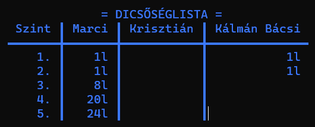
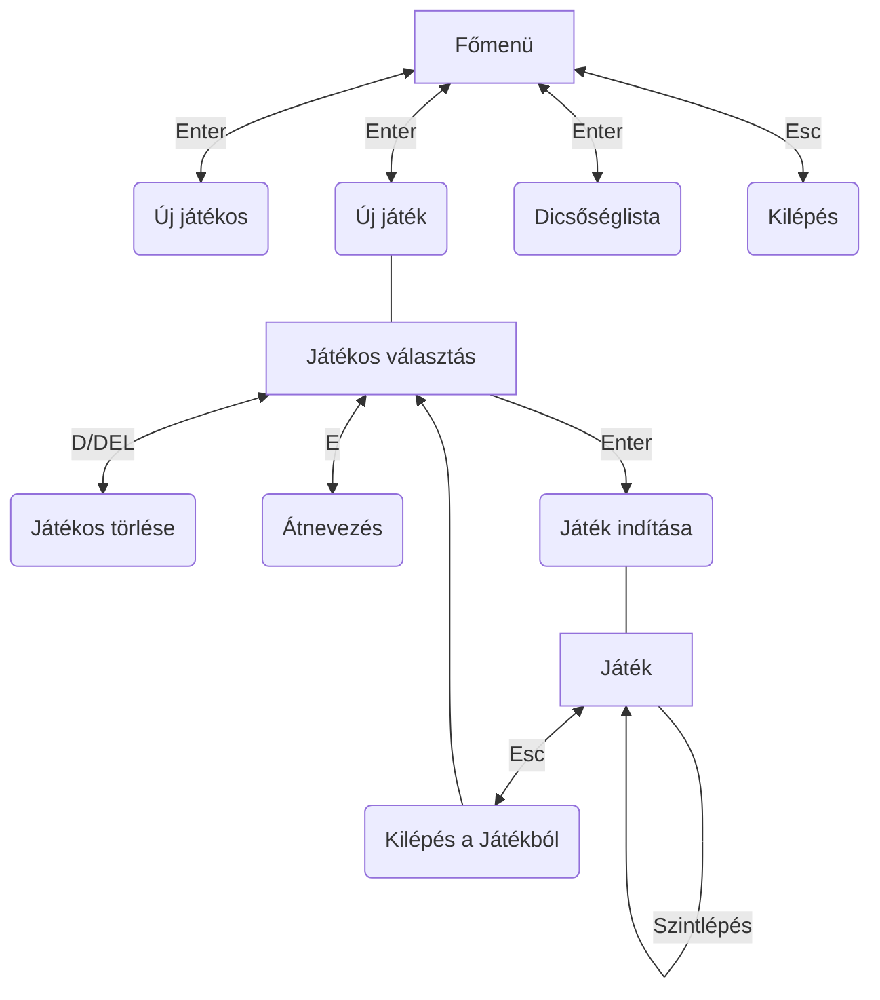

# Szokoban - Felhasználói dokumentáció
> Készítette: Szenes Márton

## Játékról
A Szokoban egy olyan játék, ahol a játékosnak ládákat kell tologatni a játékterületen úgy, hogy azok a megfelelő helyre kerüljenek. A pálya viszont olyan, hogy könnyű betolni olyan helyre a ládákat, ahonnan már nem lehet elmozdítani őket. A pálya egy 2 dimenziós felülnézetű térben helyezkedik el. A játékterület (amin belül a ládák vannak elhelyezve és a játékos) mindig fallal van körbe véve, hogy ne tudjon azon kívül mozdulni egyik objektum se. Egy adott pálya akkor van teljesítve, ha az összes célmezőre egy-egy láda lett tolva. A Pályák nehézség szerinti sorrendben következnek egymás után.

## Program használata

### Főmenü
A program elindításakor a __[Főmenü](#főmenü)__ jelenik meg a terminálon. A programban mindig a bal alsó sarokban találhatóak meg a navigációs billentyűk, amikkel lehet a kiválasztást vagy a játékost mozgatni vagy belemenni egy menüpontba, vagy kilépni belőle.  
A főmenüben a következő menüpontokat lehet találni:
- [Új játékos](#új-játékos)
- [Játék indítása](#játék-indítása)
- [Dicsőséglista](#dicsőséglista) 
- [Kilépés](#kilépés)

A menüben a `↑`(fel), `↓` (le), `→` (jobbra), `←` (balra) kurzor billentyűkkel lehet navigálni. Egy menüpont  kiválasztása az `Enter` billentyű lenyomásával lehetéséges. Visszalépni egy menüpontból az `Esc` vagy a `Backspace` billentyűkkel lehetséges. Ha a főképernyőn nyomjuk meg utóbbi billentyűk valamelyikét, akkor a [Kilépés](#kilépés) menü jön fel. 

### Új játékos
Az *Új játékos* menüt kiválasztva megjelenik egy 20 karakter széles beviteli mező. Ide lehet bevinni a billentyűzetről az új játékos nevét, ami tartalmazhat ékezetes- és nem ékezetes karaktereket is. A kívánt név beírása után az `Enter`-t lenyomva elmenti a program a játékosnevet, és visszalép a [Főmenü](#főmenü)-be. Ha mégsem szeretne a felhasználó új nevet bevinni, akkor üres sornál nyomja meg az `Enter`-t.  

### Játék indítása
A _Játék indítása_ menüt kiválasztva megjelennek az adatbázisban szereplő játékosok és teljesített szintjeik száma. Amennyiben még egy játékos sem lett felvéve az adatbázisba, akkor a _"Nincs egy játékos sem még."_ felirat jelenik meg. A Játékos felvételéhez navigáljon az [Új játékos](#új-játékos) menübe. A játékosok között a kurzor billentyűkkel ( `↑`(fel), `↓` (le) ) lehet navigálni, és az `Enter` billentyűt lenyomva lehet kiválasztani egy játékost és elindítani a [Játékot](#játékmenet).

| Üres játékoslista                                                                     | Nem üres játékoslista                                  |
|---------------------------------------------------------------------------------------|--------------------------------------------------------|
|  |  |

#### Játékosnév szerkesztése
A felvett játékosok nevét lehet szerkeszteni. Ehhez navigálja a kijelölést a kívánt játékosra a listában, és az `E` billentyű lenyomásával megnyílik a játékosnév szerkesztése almenü, amiben átírhatja a nevet. A mentéshez nyomja meg az `Enter`-t. Ha mégsem szeretné szerkeszteni, nyomjon `Enter`-t az üres sornál.  

#### Játékos törlése
A felvett játékosokat lehet törölni. Ehhez navigálja a kijelölést az eltávolítani kívánt játékosra a listába, és a `D` / `DELETE` billentyű lenyomásával megjelenik egy ablak, amiben rákérdez a program, hogy _"Biztos törlöd?"_-e. _Igen_/_Nem_ opciók közül az _Igen_-t választva törlődik a játékos az adatbázisból, a _Nem_-et választva pedig visszatér a program a [Játékoslistához](#játék-indítása).  

### Dicsőséglista
A _Dicsőséglista_ menüt kiválasztva megjelenik egy táblázat, amiben a játékosok a egyes szinteken megtett lépések számát jeleníti meg. A fejlécben a játékosok nevei találhatóak, a bal szélső oszlopban pedig a szint sorszáma. 

### Kilépés

A _Kilépés_ menüt kiválasztva megjelenik egy ablak, amiben rákérdez a program, hogy _"Biztos kilépsz?"_-e. _Igen_/_Nem_ opciók közül az _Igen_-t választva a program leáll, a _Nem_-et választva pedig visszatér a program a [Főmenü](#főmenü)-be.

## Játékmenet
### Tutorial pálya
A játék elindításakor megjelenik a pálya, a pálya szintjének a sorszáma és a megtett lépések száma. Ha új játékos indítja el első alkalommal a játékot, akkor a tutorial szint indul el, ahol röviden elmagyarázza a program a játékot. Ez a szint nem számít bele a statisztikába. Célja, hogy megismerje a felhasználó a játékos bábu mozgatását és a doboz tologatási lehetőségét. 
A pályánt kirajzoló elemek:
- Fal: █
- Játékos: ☻
- Játékos a célmezőn: ☻
- Doboz: ◼
- Doboz a célmezőn: ◼
- Célmező: ◻

### A játék
A további szinteken már csak a szint sorszáma és a lépésszám lesz megjelenítve a pálya mellett. A navigációs billentyűk, ahogy a menüben is a képernyő bal alsó sarkában találhatóak.
- **Mozgás:** A játékos bábu mozgatását a kurzor billentyűkkel lehet (`↑`(fel), `↓` (le), `→` (jobbra), `←` (balra)) 
- **Visszalépés:** Egy lépés visszavonását a `V` billentyű lenyomásával lehet elérni, azonban minden egyes visszalépés ugyanúgy lépésnek számít, így egyel növeli a lépések számát, hogy _fair play_ (sportszerű) legyen ennek a funkciónak a használata. 
- **Újrakezdés:** Az `R` billentyű lenyomásával újraindul az adott szint, visszaáll minden mező az eredeti állapotára és a lépésszámláló is nullázódik. Ezáltal újból megpróbálhatja a játékos a pályát teljesíteni elölről.

## Játék menürendszere

> Jó játékot kíván a készítő, Szenes Márton!
  
