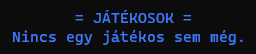

# Szokoban - Felhasználói dokumentáció
> Készítette: Szenes Márton

## Játékról
A Szokoban egy olyan játék, ahol a játékosnak ládákat kell tologatni a játékterületen úgy, hogy azok a megfelelő helyre kerüljenek. A pálya viszont olyan, hogy könnyű betolni olyan helyre a ládákat, ahonnan már nem lehet elmozdítani őket. A pálya egy 2 dimenziós felülnézetű térben helyezkedik el. A játékterület (amin belül a ládák vannak elhelyezve és a játékos) mindig fallal van körbe véve, hogy ne tudjon azon kívül mozdulni egyik objektum se. Egy adott pálya akkor van teljesítve, ha az összes célmezőre egy-egy láda lett tolva. A Pályák nehézség szerinti sorrendben következnek egymás után.

## Program használata
### Főmenü
A program elindításakor a __[Főmenü](#főmenü)__ jelenik meg a terminálon. A főmenüben a következő menüpontokat lehet találni:
- [Új játékos](#új-játékos)
- [Játék indítása](#játék-indítása)
- [Dicsőséglista](#dicsőséglista) 
- [Kilépés](#kilépés)

A menüben a `↑`(fel), `↓` (le), `→` (jobbra), `←` (balra) kurzor billentyűkkel lehet navigálni. Egy menüpont  kiválasztása az `Enter` billentyű lenyomásával lehetéséges. Visszalépni egy menüpontból az `Esc` vagy a `Backspace` billentyűkkel lehetséges. Ha a főképernyőn nyomjuk meg utóbbi billentyűk valamelyikét, akkor a [Kilépés](#kilépés) menü jön fel. 

#### Új játékos
Az *Új játékos* menüt kiválasztva megjelenik egy 20 karakter széles beivetli mező. Ide lehet bevinni a billentyűzetről az új játékos nevét, ami tartalmazhat ékezetes- és nem ékezetes karaktereket is. A kívánt név beírása után az `Enter`-t lenyomva elmenti a program a játékosnevet, és visszalép a [Főmenü](#főmenü)-be. Ha mégsem szeretne a felhasználó új nevet bevinni, akkor üres sornál nyomja meg az `Enter`-t. 

#### Játék indítása
> [!NOTE]
> proba note

> [!WARNING]
> warning van itt elvileg

#### Dicsőséglista

#### Kilépés
